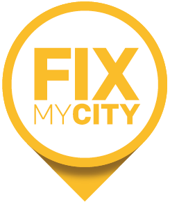

import GridCard from '../components/cards/GridCard.astro'
import GridCardWrapper from '../components/cards/GridCardWrapper.astro'
import CardsUnterstuetzer from '../components/page_partner/CardsUnterstuetzer.astro'
import Notice from '../components/Notice.astro'

<Notice colorClass="bg-pink-100 text-pink-800 prose-pink" className="mb-8 mt-8">
  

    <svg xmlns="http://www.w3.org/2000/svg" viewBox="0 0 576 512" class="size-9">
      <path
        fill="currentColor"
        d="M208 64a48 48 0 1 1 96 0 48 48 0 1 1 -96 0zM9.8 214.8c5.1-12.2 19.1-18 31.4-12.9L60.7 210l22.9-38.1C99.9 144.6 129.3 128 161 128c51.4 0 97 32.9 113.3 81.7l34.6 103.7 79.3 33.1 34.2-45.6c6.4-8.5 16.6-13.3 27.2-12.8s20.3 6.4 25.8 15.5l96 160c5.9 9.9 6.1 22.2 .4 32.2s-16.3 16.2-27.8 16.2l-256 0c-11.1 0-21.4-5.7-27.2-15.2s-6.4-21.2-1.4-31.1l16-32c5.4-10.8 16.5-17.7 28.6-17.7l32 0 22.5-30L22.8 246.2c-12.2-5.1-18-19.1-12.9-31.4zm82.8 91.8l112 48c11.8 5 19.4 16.6 19.4 29.4l0 96c0 17.7-14.3 32-32 32s-32-14.3-32-32l0-74.9-60.6-26-37 111c-5.6 16.8-23.7 25.8-40.5 20.2S-3.9 486.6 1.6 469.9l48-144 11-33 32 13.7z"
      ></path></svg
    >
    <h2 class="!mb-0 text-base leading-tight text-pink-900">Diese Seite ist im Aufbau.</h2>
  

  

    Das Unterstützernetzwerk auf dieser Seite ist zur Zeit nur ein Beispiel um das Layout und die Funktionalität der Seite zu testen.
  

</Notice>

<CardsUnterstuetzer />

<GridCardWrapper headline="Partner" sectionClasses='mt-16'>
  <GridCard
    href="/kontakt"
    text="OSM Verkehrswende Community"
  >
    

  </GridCard>
  <GridCard
    href="https://www.fixmycity.de/kontakt"
    text="FixMyCity GmbH"
  >
    

  </GridCard>
</GridCardWrapper>

## Das Projekt unterstützen

[Bitte melden Sie sich](https://www.fixmycity.de/kontakt), wenn Sie das Projekt mit Ihrer Institution unterstützen möchten.
